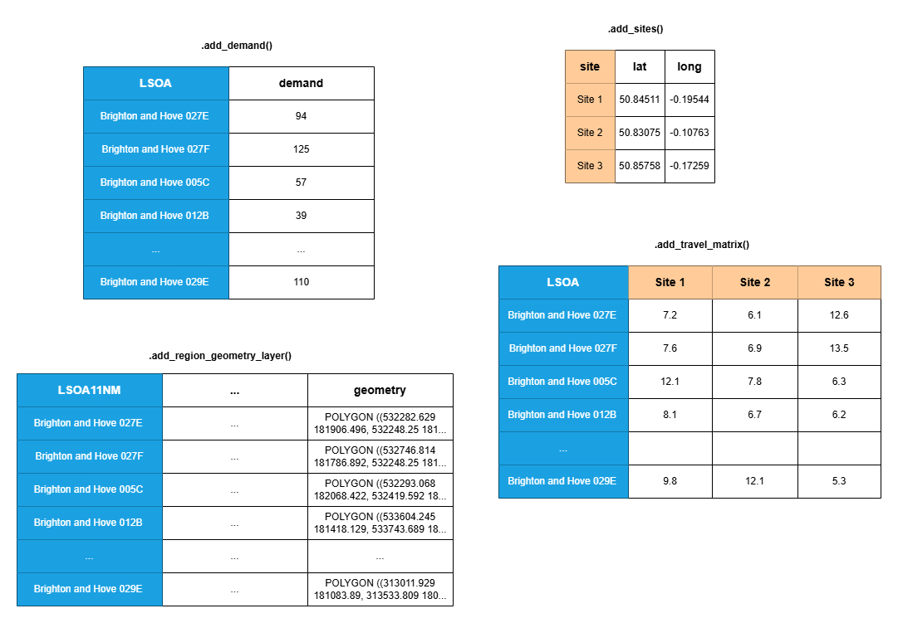

The lokigi package is designed to make it easier to undertake location analysis problems.

In many organisations - but particularly in healthcare - there is a need to be able to find a near-optimum combination of possible sites to minimize an objective. For example, you may be aiming to open an additional site to deliver healthcare services from, wanting to achieve a goal like minimizing the average travel time for each individual.

Excellent packages exist for finding optimum solutions, such as [spopt](). However, in healthcare scenarios in particular, providing only the optimum solution is often not ideal as these decisions are extremely complex and costly, and stakeholders need to understand the pros and cons of a range of near-optimal solutions to make an informed decision.

Enter lokigi.

## Setting up a site location problem

First, we need to import the `SiteProblem` class from the `lokigi.site` module.

```{python}
#| label: import
from lokigi.site import SiteProblem
```

We will set up an **instance** of the SiteProblem class. Let's just call this `problem` - but you could call it anything.

```{python}
#| label: initialise-instance
problem = SiteProblem()
```

There are four core types of data we can add to our problem object:

- a travel time (or other 'cost') matrix
- site locations \*
- per-region demand \*
- a geographic dataset representing the region being explored \*

\* indicates optional datasets

### Adding a travel time (or other 'cost') matrix

The bare minimum we need to provide to be able to undertake a location problem is a **travel matrix**.

This is a grid of travel times - or another 'cost' parameter that you want to optimize for, like the distance.

The **rows** should represent where people would start their journey from.

The first **column**

The remaining **columns** should represent where people would end their journey - i.e. all of your candidate sites.

Here is an example dataset in the correct format.

```{python}
#| echo: false
#| eval: true
#| label: show-data-matrix
import pandas as pd
pd.read_csv("../sample_data/brighton_travel_matrix_driving.csv").head(5)[["LSOA", "Site 1", "Site 2", "Site 3"]]
```

Here, someone travelling from the LSOA Brighton and Hove 027E to site 3 would have a travel time of 7.4 minutes, versus 12.9 minutes if they went to site 1.

::: callout-tip
Want to know about different ways of organising geographic information in the UK?

Check out the subsection ["What other ways do we determine areas within the UK"](https://geographic.hsma.co.uk/ct_crs.html#what-other-ways-do-we-determine-areas-within-the-uk) chapter of the HSMA geographic book.
:::

We don't have to use LSOAs for our rows, or site names for our columns - these could be anything! You might have postcode sectors for your rows and lat/long pairs for your columns, for example.

To add this data to our problem, we use the `.add_travel_matrix()` method of our `SiteProblem` instance.

```{python}
#| label: add-travel-matrix
problem.add_travel_matrix(
    travel_matrix_df="../sample_data/brighton_travel_matrix_driving.csv", # <1>
    source_col="LSOA", # <2>
    from_unit="seconds", # <3>
    to_unit="minutes" # <4>
    )
```

1.  We can pass in either a pandas object or a link to a filepath (either on your computer or on the web).
2.  We need to tell lokigi which column contains our 'source' data - i.e. the column that has the names of the locations people will be travelling from. It will then assume all other columns in the dataframe relate to the destinations; if this is not the case, the `skip_cols` parameter must be provided so that any irrelevant columns can be ignored.
3.  We can optionally convert the values in our travel matrix. This travel matrix records travel times in seconds, so we use that as our 'from_unit'...
4.  ... and we would prefer to display our times in minutes, so we provide that as the 'to' unit.

Let's now view our dataset.

```{python}
#| label: show-travel-matrix
problem.show_travel_matrix().head()
```

We can see that we the travel times for every LSOA to 6 possible sites.

::: callout-note
At present, lokigi assumes you always want to **minimize** the cost - i.e. you want people to travel the **shortest** distance or have the **shortest** travel time, or undertake journeys that emit the **least** amount of CO_2.

If you need lokigi to be able to support **maximising** a cost objective, please raise an issue on the repository: <https://github.com/hsma-tools/lokigi/issues>
:::

::: callout-tip
Interested in generating your own travel matrices in this format?

Check out the ["Lookup Up Travel Times Using APIs"](https://geographic.hsma.co.uk/mtt_travel_time_apis.html) chapter of the HSMA geographic book.
:::

## Solving a simple problem

If we don't have any other requirements, we can solve our problem right now!

Let's solve by minimizing the average travel time from all 'sources' to all 'destinations' - which we can call a "simple p-median" problem.

We'll assume we want to find the best possible combination of any 3 sites.

```{python}
#| label: solve-1
solutions = problem.solve(p=3, objectives="simple_p_median")
```

This returns an object with the lokigi class `SiteSolutionSet`.

```{python}
#| label: show-solutions-object-type
solutions
```

```{python}
#| label: show-solutions-df
solutions.show_solutions()
```

We can produce a bar plot of the solutions, showing the variation between the best and worst.

```{python}
#| label: plot-n-best-combinations-1
solutions.plot_n_best_combinations_bar()
```

## Adding in geographic data

If we have a geojson, shp or geopackage file that represents the areas we are looking at, we can pass this in as well.

Here, we are passing in a geojson that contains the

```{python}
#| label: add-region-geometry
problem.add_region_geometry_layer(
    region_geometry_df="../sample_data/LSOA_2011_Boundaries_Super_Generalised_Clipped_BSC_EW_V4.geojson", # <1>
    common_col="LSOA11NM" # <2>
    )
```

1.  We pass in the pass to a geojson, shp or geopackage file. This can be located locally or on the web.
2.  We pass in the name of the column in this geojson that should be used when trying to join to the other datasets - i.e. the column that acts as a bridge between the rows in our travel matrix and this geographic data. In our travel matrix, recall we have a column called "LSOA". This contains the LSOA names in the same format as the "LSOA11NM" in our geographic dataset - so this is what we provide as our 'common_col'.

Let's take a look at the first few rows of this geographic data.

```{python}
#| label: show-region-geometry
problem.show_region_geometry_layer().head(5)
```

However, what's more useful is plotting it.

```{python}
#| label: plot-region-geometry
problem.plot_region_geometry_layer()
```

This becomes more useful when we then solve the problem again.

```{python}
#| label: solve-plus-region-geometry
solutions = problem.solve(p=3, objectives="simple_p_median")
```

We can now plot the solution.

```{python}
#| label: plot-best-combos-no-site-data
solutions.plot_best_combination()
```

## Adding in site data

However, it would be more useful if we could see the sites on the map.

Let's load in a dataset containing the locations of our sites.

```{python}
#| label: add-sites
problem.add_sites(
    candidate_site_df="../sample_data/brighton_sites.geojson",
    candidate_id_col="site"
    )
```

::: callout-note
As we're passing in a dataset in a recognised geographic data format, it will look for a 'geography' column automatically. Alternatively, we could pass in a pandas dataframe or csv if it contains lat/long or eastings/northings, for example, specifying the 'vertical' geometry column and the 'horizontal' geometry column.
:::

Let's take a look at this data.

```{python}
#| label: show-sites
problem.show_sites()
```

Let's also plot this data.

```{python}
#| label: plot-sites
problem.plot_sites()
```

Now let's solve the problem again, this time noticing that we can plot the site data.

```{python}
#| label: solve-with-sites
solutions = problem.solve(p=3, objectives="simple_p_median")
```

We can now plot the solution. This time, we'll plot the 6 best solutions.

```{python}
#| label: plot-n-best-with-sites
solutions.plot_n_best_combinations(n_best=5)
```

## Demand Data

Finally, we can add in demand data.

With this, we can start exploring the 'standard' p-median problems, where the travel time is weighted by the number of people travelling from each region, which can support a more equitable solution.

Lokigi requires the demand data to contain a row per source region (i.e. where people will travel from).

```{python}
#| label: add-demand
problem.add_demand(
    demand_df="../sample_data/brighton_demand.csv",
    demand_col="demand",
    location_id_col="LSOA"
    )
```

```{python}
#| label: show-demand
problem.show_demand()
```

When we plot our region, this time we can look at the demand.

```{python}
#| label: plot-region-geometry-layer
problem.plot_region_geometry_layer(plot_demand=True)
```

Now we can solve for a true p-median problem rather than a simplified one. This means that the weighted travel time - the travel time adjusted by the number of people travelling from each place - will be considered.

```{python}
#| label: solve-all-data
solutions = problem.solve(
    p=3,
    objectives="p_median" # <1>
    )
```

1.  Note that we have changed our objective from "simple_p_median" to "p_median" here. We haven't had to change any other parts of our problem class, so we can easily run multiple different types of solver from our single problem class.

:::{.callout-tip}
Want a more detailed explanation of weighted travel time? Take a look at the [p-median problems](https://geographic.hsma.co.uk/intro_facility_location.html#p-median-problems) subsection of the HSMA geographic book.
:::

Let's plot the solutions again.

```{python}
#| label: plot-n-best-all-data
solutions.plot_n_best_combinations(n_best=5)
```

## Summary - the data to add to your problem class

The data you provide should take the following format.



Remember - **only the travel matrix is completely necessary**. You can include any combination of the remaining data.

The columns in blue can contain **any** unit of geographical area. In the UK, this might be LSOA, OA, MSOA, postcode, postcode sector, and so on. The column names do not need to be consistent across the three datasets as you will specify which column contains that data in each case - in this example two use the name "LSOA" while the third uses "LSOA11NM", for example.

Similarly, the columns in orange do not need to use the format shown. Your sites may have any names, as long as the names used in the site dataframe (if provided) are consistent with the names used for the columns in your travel matrix.

A more detailed breakdown of the allowed data is provided below.

+--------------------+--------------------------------------------------------------+--------------------+----------------------------------------------------+-------------------------------------------------------------+--------------------------------------------------------------------------------+-----------------------------------------------------------------------------------------------+
| Input Data         | Relevant Functions + mandatory parameters                    | Optional/Mandatory | Accepted Formats                                   | Required Columns                                            | Required Rows                                                                  | Commonalities                                                                                 |
+====================+==============================================================+====================+====================================================+=============================================================+================================================================================+===============================================================================================+
| Travel/Cost Matrix | `.add_travel_matrix(travel_matrix_df, source_col)`           | Mandatory          | - Pandas dataframe                                 | 'Destinations' (places people are travelling to) as columns | 'Sources' (places people are travelling from) as rows                          | The 'destinations' column should have destinations in the same format as the region_geometry  |
|                    |                                                              |                    |                                                    |                                                             |                                                                                |                                                                                               |
|                    | `show_travel_matrix()`                                       |                    | - Path to csv, parquet                             |                                                             | Cells are a figure to optimize on - e.g. travel time, distance, CO_2 emissions |                                                                                               |
+--------------------+--------------------------------------------------------------+--------------------+----------------------------------------------------+-------------------------------------------------------------+--------------------------------------------------------------------------------+-----------------------------------------------------------------------------------------------+
| Region Geometry    | `.add_region_geometry_layer(region_geometry_df, common_col)` | Optional           | - Geopandas dataframe                              |                                                             |                                                                                |                                                                                               |
|                    |                                                              |                    |                                                    |                                                             |                                                                                |                                                                                               |
|                    | `.show_region_geometry_layer()`                              |                    | - Path to geojson, shp or geopackage               |                                                             |                                                                                |                                                                                               |
|                    |                                                              |                    |                                                    |                                                             |                                                                                |                                                                                               |
|                    | `.plot_region_geometry_layer()`                              |                    |                                                    |                                                             |                                                                                |                                                                                               |
+--------------------+--------------------------------------------------------------+--------------------+----------------------------------------------------+-------------------------------------------------------------+--------------------------------------------------------------------------------+-----------------------------------------------------------------------------------------------+
| Site Locations     | `.add_sites(candidate_site_df, candidate_id_col)`            | Optional           | - Pandas dataframe OR geopandas dataframe          |                                                             |                                                                                |                                                                                               |
|                    |                                                              |                    |                                                    |                                                             |                                                                                |                                                                                               |
|                    | `.show_sites()`                                              |                    | - Path to csv, parquet, geojson, shp or geopackage |                                                             |                                                                                |                                                                                               |
|                    |                                                              |                    |                                                    |                                                             |                                                                                |                                                                                               |
|                    | `.plot_sites()`                                              |                    |                                                    |                                                             |                                                                                |                                                                                               |
+--------------------+--------------------------------------------------------------+--------------------+----------------------------------------------------+-------------------------------------------------------------+--------------------------------------------------------------------------------+-----------------------------------------------------------------------------------------------+
| Demand             | `.add_demand(demand_df, demand_col, location_id_col)`        | Optional           | - Pandas dataframe                                 |                                                             |                                                                                |                                                                                               |
|                    |                                                              |                    |                                                    |                                                             |                                                                                |                                                                                               |
|                    | `.show_demand()`                                             |                    | - Path to csv or parquet                           |                                                             |                                                                                |                                                                                               |
+--------------------+--------------------------------------------------------------+--------------------+----------------------------------------------------+-------------------------------------------------------------+--------------------------------------------------------------------------------+-----------------------------------------------------------------------------------------------+

## Summary - the key object types

### SiteProblem

The SiteProblem object is used to store all relevant data for the problem.

You initialise an empty SiteProblem, then run the methods detailed above to add the relevant datasets to the object.

You then call the .solve() method to create the SiteSolutionSet containing the ranked solutions.

### SiteSolutionSet

A SiteSolutionSet is created by calling .solve() on your SiteProblem.

This object contains lot of methods for plotting the solutions.

### EvaluatedCombination

*Developer use only*

During the process of generating solutions, an EvaluatedCombination object will be created for every evaluated set of sites. This is not directly available to you after you have solved your problem.
