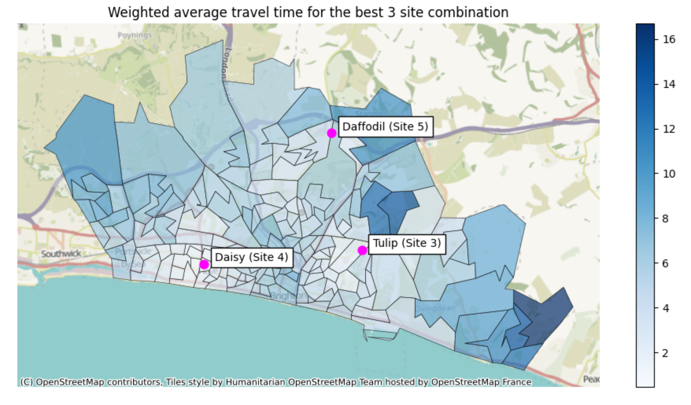
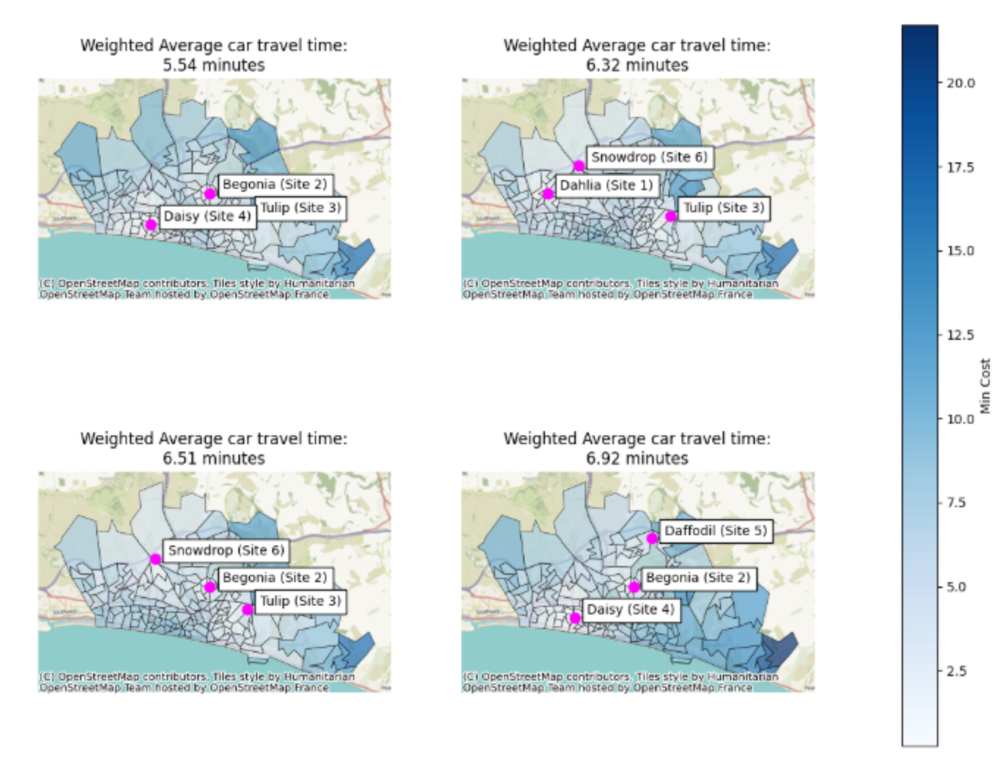
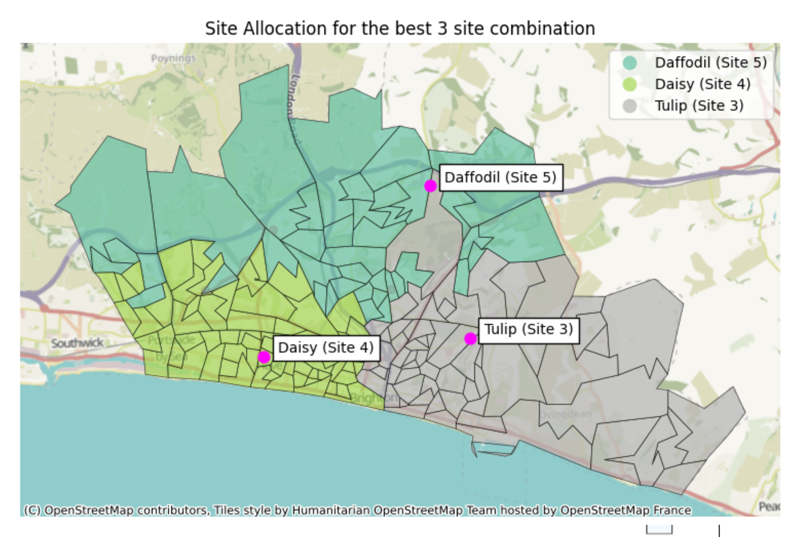
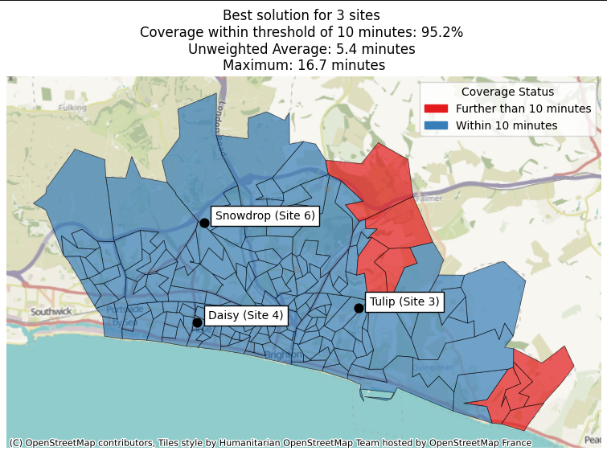
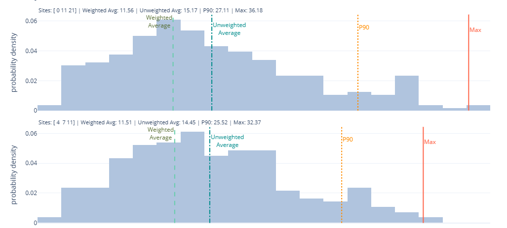
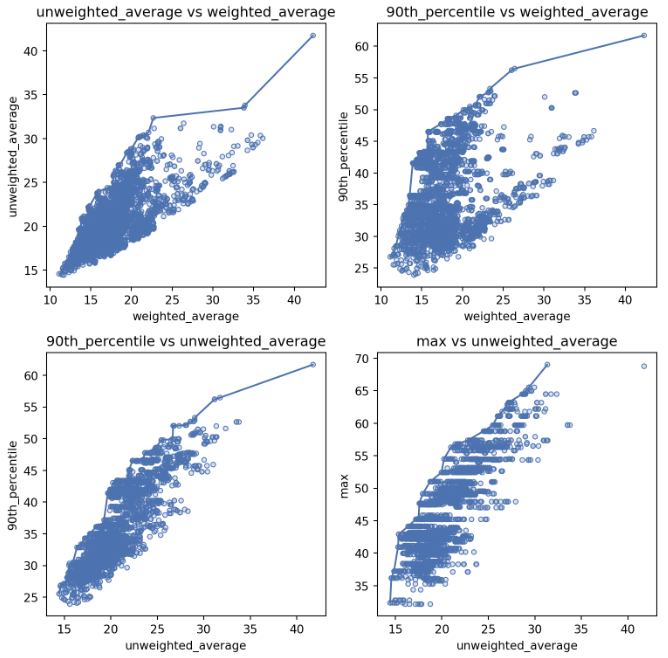

```{=html}
<style>
.splide__slide {
  text-align: center;
}

.splide__slide img {
  max-height: 450px;
  max-width: 80%;
  display: inline-block;
}

.splide__optional-button-container {
  margin-bottom: 1rem;
  margin-top: 1rem;
  text-align: right;
  font-size: 1rem;
}

.splide__toggle a {
    color: #fff;
    text-decoration: none;
    text-transform: uppercase;
    font-weight: 200;
}

.splide__toggle {
    border: none;
}

.lokigi_caption {
    padding: 30px 40px;
    font-weight:300;
    font-size: 0.8rem;
    opacity: 0.8; /* very subtle fade */
    letter-spacing: 0.3px;
    line-height: 1.7;

}

</style>

<script src=" https://cdn.jsdelivr.net/npm/@splidejs/splide@4.1.4/dist/js/splide.min.js "></script>

<link rel="stylesheet" href=" https://cdn.jsdelivr.net/npm/@splidejs/splide@4.1.4/dist/css/splide.min.css">

<script>
  document.addEventListener( 'DOMContentLoaded', function () {
    new Splide( '#image-carousel' , {
        type    : 'loop',
        autoplay: 'play',
        perPage : 1,
        interval: 9000,
        pauseOnHover : false,
        pauseOnFocus : false,
        resetProgress: false
    } ).mount();
} );
</script>

```

<h1 style="text-align: center;">lokigi</h1>

<p style="text-align: center; font-size: 22px;">
  Make better, evidence-based decisions about where to locate your healthcare (and other) services
</p>

lokigi exists to make the process of providing decision support for healthcare problems with a geographical component easier. Whether you're planning a whole range of new services, adding a few new sites to an existing set of locations, or making difficult decisions about minimising the impact of service closures, lokigi can help.

Focussing on solving discrete facility location problems — problems where you need to make the best decision from a range of candidate locations — lokigi provides tools to structure your problem, run optimization algorithms, and communicate the results effectively.


```{=html}

<section id="image-carousel" class="splide" aria-label="Beautiful Images">
<div class="splide__optional-button-container">
  <button class="splide__toggle" type="button">
    <a class="splide__toggle__play"><i class="fa-solid fa-play" ></i><span style="padding-left: 10px;">Resume Slideshow</span></a>
    <a class="splide__toggle__pause"><i class="fa-solid fa-pause" ></i><span style="padding-left: 10px;">Pause Slideshow</span></a>
  </button>
  </div>
  <div class="splide__track">
		<ul class="splide__list">
			<li class="splide__slide">
				
          <div class="lokigi_caption" data-splide-interval="30000">
					Lokigi supports you in solving location allocation problems. Designed as a beginner-friendly library but powerful and flexible enough for advanced users too, lokigi handles the logic and includes a range of pre-designed outputs to help generate clear, compelling business cases.
			</li>
			<li class="splide__slide">
				
          <div class="lokigi_caption" data-splide-interval="30000">
					Often just providing a single optimal solution isn't enough. Unlike other libraries, lokigi aims to provide a range of good solutions, allowing decision makers to be presented with a menu of possible options so they can make the best decision when real-world constraints are factored in.
			</li>
			<li class="splide__slide">
				
          <div class="lokigi_caption" data-splide-interval="30000">
					Lokigi's visualisations are designed to meet a range of common needs, such as showing which site a population in a given region is served by, communicating this in ready-to-go but fully customisable maps.
			</li>
			<li class="splide__slide">
				
          <div class="lokigi_caption" data-splide-interval="30000">
					Lokigi allows you to solve a range of industry standard problem types, including<br>
          • <b>p-median</b> (minimizing average travel time, optionally weighted by a factor like demand)<br>
          • <b>p-center</b> (minimizing the maximum travel time for any region)<br>
          • and the <b>maximal coverage location problem</b> (maximising the number of people within a certain distance or time of facilities)<br>
			</li>
			<li class="splide__slide">
				
          <div class="lokigi_caption" data-splide-interval="30000">
          Lokigi supports problems both with and without geographic coordinates, with a range of visualisations that allow you to solve problems even when you don't have the data you need to generate maps.<br><br>
          Extensions such as accounting for facility capacity, solving the location set covering problem, and boundary optimization are planned for the future.
			</li>
			<li class="splide__slide">
				
          <div class="lokigi_caption" data-splide-interval="30000">
					With a range of visualisations aimed at helping you understand the trade-offs between different solutions, lokigi is the ideal tool for helping you make better decisions about locations when faced with competing priorities.
			</li>
		</ul>
  </div>
</section>

<br>
```

:::: {.columns}

::: {.column width='20%'}

:::

::: {.column width='60%'}

<p style="text-align: center; font-size: 24px; font-weight: bold">
  Install with a single command
</p>

```{.bash}
pip install lokigi
```

:::

::: {.column width='20%'}

:::

::::

<br>

```{=html}
<div class="value-grid-2" style="justify-content:center; text-align:center;">
  <a href="https://hsma-tools.github.io/lokigi/lokigi_docs/getting_started.html" class="value-box bg-blue">
    <div class="icon"><i class="fa-solid fa-circle-play"></i></div>
    <div class="value">Getting Started</div>
    <div class="details">Get an overview of how lokigi works</div>
  </a>
    <a href="https://hsma-tools.github.io/lokigi/examples/examples.html" class="value-box bg-blue">
    <div class="icon"><i class="fa-solid fa-lightbulb"></i></div>
    <div class="value">Examples</div>
    <div class="details">Take a look at our wide range of lokigi examples</div>
  </a>
</div>
```

```{=html}
<div class="value-grid-2" style="justify-content:center; text-align:center;">
    <a href="https://hsma-tools.github.io/lokigi/reference/" class="value-box bg-blue" style="grid-column: span 2;">
    <div class="icon"><i class="fa-solid fa-book-atlas"></i></div>
    <div class="value">API Reference</div>
    <div class="details">Browse the full list of lokigi classes and functions</div>
  </a>
</div>
```

<br>

## What does the name mean?

**lokigi** is the [Esperanto](https://en.wikipedia.org/wiki/Esperanto) {height=30px} for 'to locate' or 'to place'

It can also be read as the backronym 'Location Optimisation: K-best solution Inspection, Generation & Insights' - whichever floats your boat.

<br>

## How to cite lokigi

Coming soon!

## Acknowledgements

Thanks goes to all of the following people ([emoji key](https://allcontributors.org/docs/en/emoji-key)).


<!-- ALL-CONTRIBUTORS-LIST:START - Do not remove or modify this section -->
<!-- prettier-ignore-start -->
<!-- markdownlint-disable -->
<table>
  <tbody>
    <tr>
      <td align="center" valign="top" width="14.28%"><a href="http://hsma.co.uk"><br /><sub><b>Sammi Rosser</b></sub></a><br /><a href="https://github.com/hsma-tools/lokigi/commits?author=Bergam0t" title="Code">💻</a> <a href="https://github.com/hsma-tools/lokigi/commits?author=Bergam0t" title="Documentation">📖</a> <a href="https://github.com/hsma-tools/lokigi/commits?author=Bergam0t" title="Tests">⚠️</a> <a href="https://github.com/hsma-tools/lokigi/issues?q=author%3ABergam0t" title="Bug reports">🐛</a> <a href="#content-Bergam0t" title="Content">🖋</a> <a href="#design-Bergam0t" title="Design">🎨</a> <a href="#example-Bergam0t" title="Examples">💡</a> <a href="#ideas-Bergam0t" title="Ideas, Planning, & Feedback">🤔</a> <a href="#infra-Bergam0t" title="Infrastructure (Hosting, Build-Tools, etc)">🚇</a> <a href="#maintenance-Bergam0t" title="Maintenance">🚧</a> <a href="#projectManagement-Bergam0t" title="Project Management">📆</a> <a href="#research-Bergam0t" title="Research">🔬</a> <a href="#tutorial-Bergam0t" title="Tutorials">✅</a></td>
      <td align="center" valign="top" width="14.28%"><a href="https://experts.exeter.ac.uk/19244-thomas-monks"><br /><sub><b>Tom Monks</b></sub></a><br /><a href="https://github.com/hsma-tools/lokigi/commits?author=TomMonks" title="Code">💻</a> <a href="#ideas-TomMonks" title="Ideas, Planning, & Feedback">🤔</a> <a href="#mentoring-TomMonks" title="Mentoring">🧑‍🏫</a></td>
      <td align="center" valign="top" width="14.28%"><a href="https://sites.google.com/nihr.ac.uk/hsma"><br /><sub><b>Dr Daniel Chalk</b></sub></a><br /><a href="#mentoring-hsma-chief-elf" title="Mentoring">🧑‍🏫</a></td>
      <td align="center" valign="top" width="14.28%"><a href="https://www.linkedin.com/in/amyheather"><br /><sub><b>Amy Heather</b></sub></a><br /><a href="#infra-amyheather" title="Infrastructure (Hosting, Build-Tools, etc)">🚇</a></td>
    </tr>
  </tbody>
</table>

<!-- markdownlint-restore -->
<!-- prettier-ignore-end -->

<!-- ALL-CONTRIBUTORS-LIST:END -->

<br>

## Licence

lokigi is released under the MIT licence.




